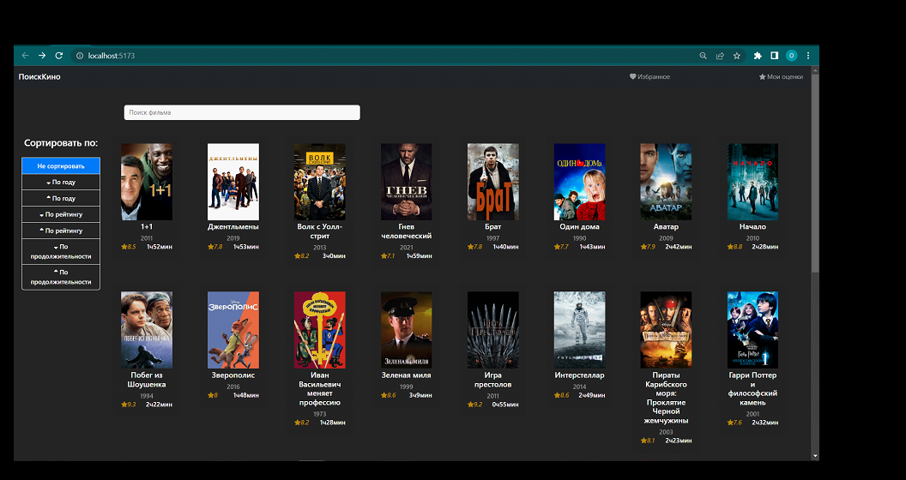
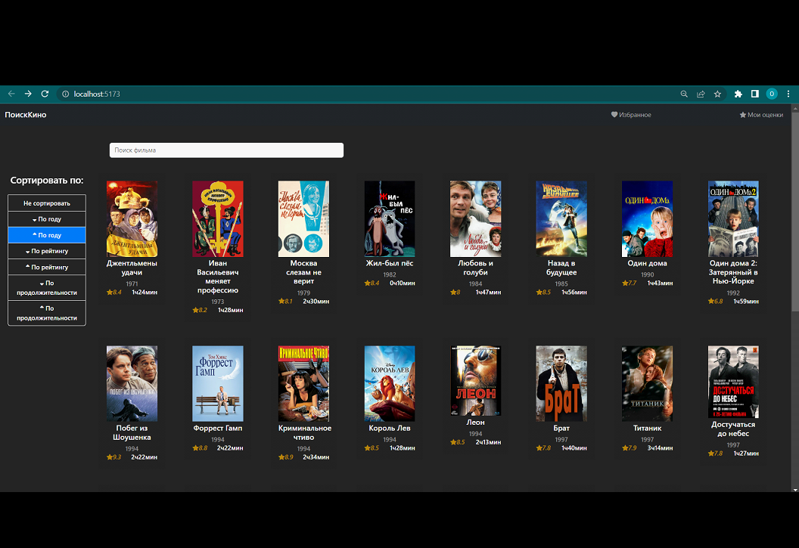
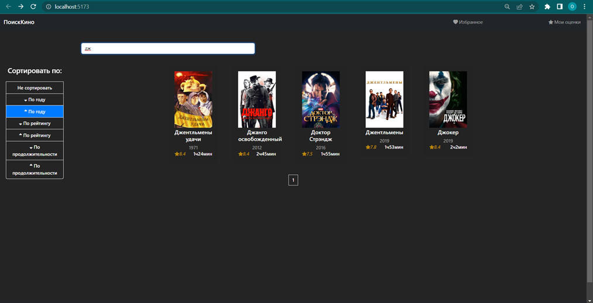
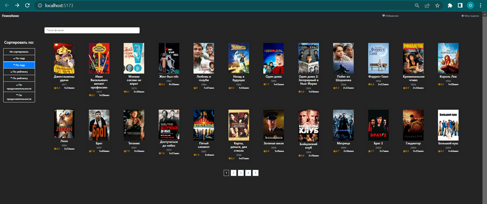
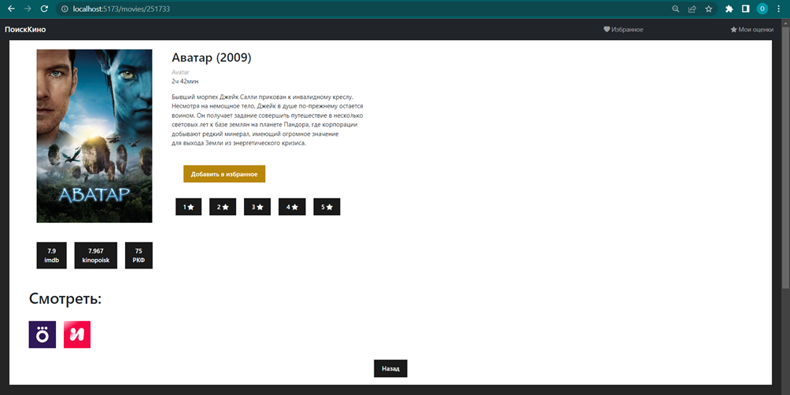
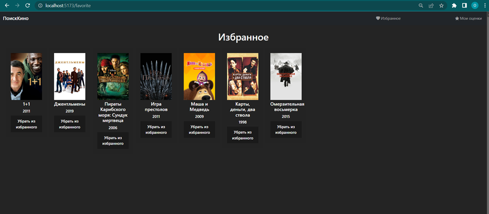
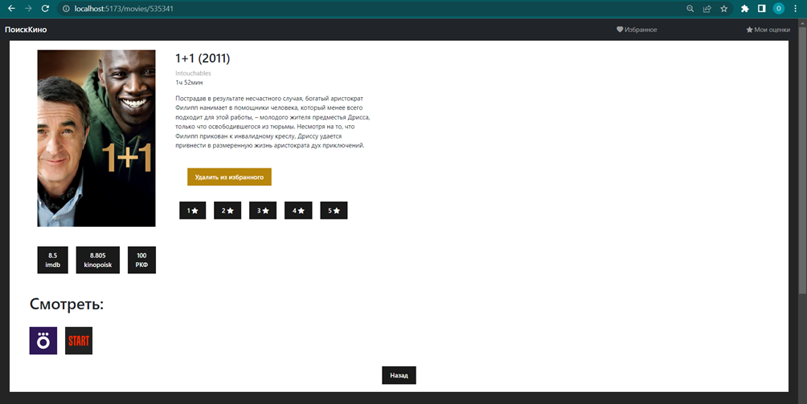
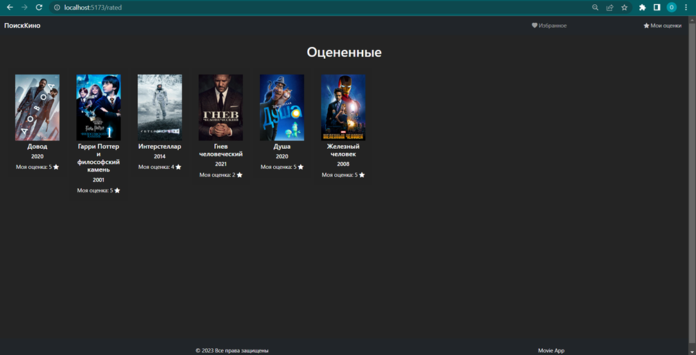
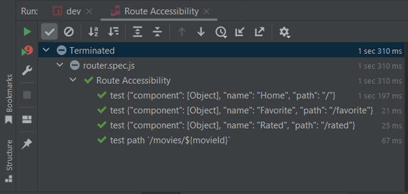

# ПоискКино

### На данном вебсайте был реализован следующий функционал:

1. Главная страница:

   1.1 Отображение списка фильмов в виде карточек с постером, названием,
   рейтингом и годом.

   1.2 Возможность поиска фильма по названию. 

   1.3 Возможность сортировки по году, рейтингу, хронометражу.

   1.4 Пагинация страниц, отображение фиксированного числа фильмов на
   странице.

2. Страница фильма:

   2.1 Возможность посмотреть расширенные данные о фильме - описание,
   оригинальное название и остальные поля из БД.
   
   2.2 Возможность поставить оценку.
   
   2.3 Возможность добавить фильм в избранное / удалить из избранного.

3. Страница с избранными фильмами:
   
   3.1 Отображение всех фильмов, которые пользователь добавил в избранное
   
   3.2 Возможность убрать фильм из избранного

4. Страница с оценками:
   
   4.1 Отображение всех фильмов, которые пользователь оценил

Были реализованы следующие элементы:
1.  Страницы:
    
   - Main - Главная страница
    
   - MoviePage - Страница фильма
   
   - RatedMovies - Страница избранного
    
   - Favorites - Страница с оценками

2.  Компоненты:

- FilterSort.vue – сортировка фильмов

- Sort.vue – поиск фильмов
- Footer.vue – шапка сайта
- Header.vue – подвал сайта
- MovieCard.vue – компонент карточки фильма
- Pagination.vue – пагинация страниц

3.  Роутинг:
- '/' – главная страница
- '/movies/:id'- Страница фильма
- '/favorite'- Страница избранного
- '/rated'- Страница с оценками

Общий вид Главной страницы сайта:

Все кнопки сайта кликабельны и отображают корректную информацию. Пример сортировки по году по возрастанию используя компоненту Sort.vue:

Функционал поиска фильма по введенному тексту «дж» в строке поиска:

Пагинация продемонстрирована в меньшем масштабе страницы, чтобы было видно нижний элемент, который отображает количество страниц по 24 фильма:

Страница фильма, на которой отображается компонент MovieCard.vue в расширенном формате:

Отображение фильмов на странице избранное с кнопками «Удалить из избранного»:

Также фильм можно удалить из избранного на самой странице фильма:

Отображение фильмов на странице «Мои оценки», где отображается оценка, выставленная пользователем:

Модульный тест для тестирования маршрутизации в проекте. Тест проведен с использованием Jest и Vue Test Utils. В каждом тестовом случае используется router.push для навигации на определенный URL. Затем проверяется, что текущий компонент соответствует ожидаемому компоненту после навигации с помощью wrapper.findComponent и метода exists().
